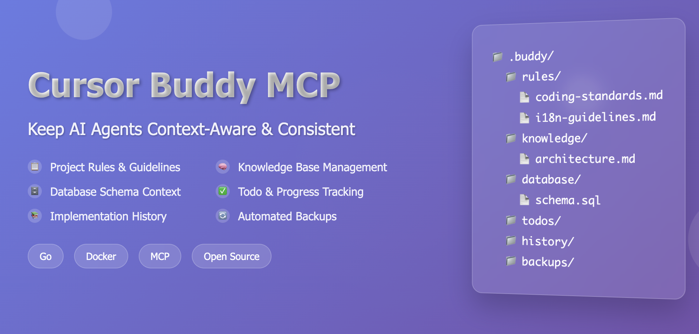

# Cursor Buddy MCP

**Keep AI Agents Context-Aware & Consistent**

An intelligent MCP server that transforms how AI agents interact with your codebase by providing rich, structured context about your project's rules, knowledge, todos, database schema, and implementation history. No more repetitive explanations or inconsistent responses - your AI assistant becomes a true coding partner that understands your project's standards and conventions.

## Why Cursor Buddy MCP?

🎯 **Context-Aware AI**: Your AI assistant instantly knows your coding standards, architectural patterns, and project conventions  
📚 **Centralized Knowledge**: All project documentation and guidelines in one searchable location  
✅ **Progress Tracking**: Automatic todo management and implementation history tracking  
🔄 **Real-time Updates**: File monitoring ensures your AI always has the latest information  
🚀 **Zero Setup Friction**: Drop-in Docker container with immediate MCP integration  

## Architecture

This server implements the [Model Context Protocol (MCP)](https://modelcontextprotocol.io) using the Go SDK from [mark3labs/mcp-go](https://github.com/mark3labs/mcp-go). The server communicates over stdin/stdout using JSON-RPC 2.0, making it compatible with MCP clients like Claude Desktop.

### MCP Features Implemented

- **Tools**: 6 interactive tools for managing project context
- **Resources**: Project context resource with complete project state
- **Stdio Transport**: Standard input/output communication
- **Real-time Updates**: File monitoring with automatic reloading

## Quick Start

### 1. Pull from GitHub Registry
```bash
docker pull ghcr.io/omar-haris/cursor-buddy-mcp:latest
```

### 2. Configure Cursor
Add to `.cursor/mcp.json`:
```json
{
  "mcpServers": {
    "cursor-buddy-mcp": {
      "command": "docker",
      "args": [
        "run", "-i", "--rm",
        "-v", "/path/to/your/project/.buddy:/home/buddy/.buddy",
        "-e", "BUDDY_PATH=/home/buddy/.buddy",
        "ghcr.io/omar-haris/cursor-buddy-mcp:latest"
      ]
    }
  }
}
```

### 3. Create .buddy folder
```bash
mkdir -p .buddy/{rules,knowledge,todos,database,history,backups}
```

### 4. Add content
Create files in `.buddy/` folders following the formats below.

## Available Tools

- **buddy_get_rules** - Get coding standards and guidelines
- **buddy_search_knowledge** - Search project documentation
- **buddy_manage_todos** - List/update tasks and track progress
- **buddy_get_database_info** - Get schema info and validate queries
- **buddy_history** - Track implementation changes and search history
- **buddy_backup** - Create and manage file backups

## Usage Examples

Ask your AI assistant questions like:
- "What are our coding standards for error handling?"
- "Show me current todos for the authentication feature"
- "Search for API documentation about user endpoints"
- "What's the database schema for the users table?"
- "How did we implement JWT authentication last month?"

## How to Write .buddy Files

### 📋 Rules Files (`.buddy/rules/`)

Rules define your project's coding standards, architectural patterns, and guidelines.

**Format Requirements:**
- Use markdown format (`.md`)
- Include metadata: `category` and `priority`
- Organize with clear sections and subsections

**Example - Coding Standards** (`.buddy/rules/coding-standards.md`):
```markdown
# Coding Standards
- category: coding
- priority: critical

## Overview
Core coding standards and best practices for the project.

## Go-Specific Standards
- Follow Go naming conventions (camelCase, PascalCase)
- Use `gofmt` for code formatting
- Handle errors explicitly, don't ignore them
- Use interfaces for abstraction

## Error Handling
- Always check and handle errors
- Use structured error types
- Wrap errors with context using `fmt.Errorf`
- Return meaningful error messages

## Testing
- Write unit tests for all public functions
- Use table-driven tests for multiple test cases
- Achieve minimum 80% code coverage
```

**Example - Architecture Patterns** (`.buddy/rules/architecture-patterns.md`):
```markdown
# Architecture Patterns
- category: architecture
- priority: critical

## Design Principles
- **Single Responsibility**: Each component has one reason to change
- **Dependency Inversion**: Depend on abstractions, not concretions

## Recommended Patterns

### Repository Pattern
- Encapsulate data access logic
- Provide consistent interface for data operations
- Enable easy testing with mock implementations

### Layered Architecture
┌─────────────────────┐
│   Presentation      │  ← HTTP handlers, CLI
├─────────────────────┤
│   Business Logic    │  ← Domain models, use cases
├─────────────────────┤
│   Data Access       │  ← Repositories, databases
└─────────────────────┘
```

### 📚 Knowledge Files (`.buddy/knowledge/`)

Knowledge files contain project documentation, API specs, and technical information.

**Format Requirements:**
- Use markdown format (`.md`)
- Include metadata: `category` and optional `tags`
- Structure with clear headings and examples

**Example - API Documentation** (`.buddy/knowledge/api.md`):
```markdown
# API Documentation
- category: architecture
- tags: api, rest, authentication

## Authentication Endpoints

### POST /auth/login
**Request:**
```json
{
  "email": "user@example.com",
  "password": "secure_password"
}
```

**Response:**
```json
{
  "token": "jwt_token_here",
  "user": {
    "id": 123,
    "email": "user@example.com",
    "role": "user"
  }
}
```

### GET /auth/me
**Headers:** `Authorization: Bearer <token>`

**Response:**
```json
{
  "user": {
    "id": 123,
    "email": "user@example.com",
    "role": "user"
  }
}
```

## Error Handling
All endpoints return errors in this format:
```json
{
  "error": "error_code",
  "message": "Human readable message"
}
```
```

**Example - Database Documentation** (`.buddy/knowledge/database.md`):
```markdown
# Database Documentation
- category: database
- tags: schema, migrations, queries

## User Management

### Users Table
- `id` (PRIMARY KEY) - Auto-incrementing user ID
- `email` (UNIQUE) - User's email address
- `password_hash` - Bcrypt hashed password
- `created_at` - Account creation timestamp
- `updated_at` - Last update timestamp

### Common Queries
```sql
-- Get user by email
SELECT id, email, created_at FROM users WHERE email = $1;

-- Create new user
INSERT INTO users (email, password_hash) VALUES ($1, $2) RETURNING id;

-- Update user info
UPDATE users SET email = $1, updated_at = NOW() WHERE id = $2;
```

## Indexes
- `idx_users_email` - Unique index on email for fast lookups
- `idx_users_created_at` - Index on created_at for reporting queries
```

### ✅ Todo Files (`.buddy/todos/`)

Todo files track tasks, features, and project progress using markdown checkboxes.

**Format Requirements:**
- Use markdown format (`.md`)
- Use checkbox syntax: `- [ ]` (incomplete) or `- [x]` (complete)
- Group related tasks under clear headings
- Include context and details for each task

**Example - Feature Development** (`.buddy/todos/authentication.md`):
```markdown
# Authentication Feature

## Backend Implementation
- [x] Set up JWT library
- [x] Create user model and database migration
- [x] Implement password hashing with bcrypt
- [ ] Create login endpoint
- [ ] Create registration endpoint
- [ ] Add middleware for protected routes
- [ ] Write unit tests for auth service
- [ ] Add integration tests for auth endpoints

## Frontend Implementation
- [ ] Create login form component
- [ ] Create registration form component
- [ ] Implement JWT token storage
- [ ] Add authentication context
- [ ] Create protected route wrapper
- [ ] Handle token refresh logic

## Security & Testing
- [ ] Add rate limiting to auth endpoints
- [ ] Implement account lockout after failed attempts
- [ ] Add password strength validation
- [ ] Security audit of auth implementation
- [ ] Load testing for auth endpoints
```

**Example - Bug Fixes** (`.buddy/todos/bugs.md`):
```markdown
# Bug Fixes

## Critical Issues
- [ ] Fix memory leak in websocket connections
- [ ] Resolve database connection pool exhaustion
- [x] Fix CORS issues with API endpoints

## Minor Issues
- [ ] Update error messages to be more user-friendly
- [ ] Fix pagination bug in user list
- [x] Correct timestamp formatting in logs
- [ ] Update deprecated API endpoints

## Technical Debt
- [ ] Refactor legacy authentication code
- [ ] Update outdated dependencies
- [ ] Add missing database indexes
- [ ] Improve test coverage for edge cases
```

### 🗄️ Database Files (`.buddy/database/`)

Database files contain SQL schema definitions, migrations, and query examples.

**Example - Schema Definition** (`.buddy/database/schema.sql`):
```sql
-- Users table
CREATE TABLE users (
    id SERIAL PRIMARY KEY,
    email VARCHAR(255) UNIQUE NOT NULL,
    password_hash VARCHAR(255) NOT NULL,
    role VARCHAR(50) DEFAULT 'user',
    created_at TIMESTAMP DEFAULT CURRENT_TIMESTAMP,
    updated_at TIMESTAMP DEFAULT CURRENT_TIMESTAMP
);

-- Sessions table for JWT blacklisting
CREATE TABLE sessions (
    id SERIAL PRIMARY KEY,
    user_id INTEGER REFERENCES users(id) ON DELETE CASCADE,
    token_hash VARCHAR(255) UNIQUE NOT NULL,
    expires_at TIMESTAMP NOT NULL,
    created_at TIMESTAMP DEFAULT CURRENT_TIMESTAMP
);

-- Indexes for performance
CREATE INDEX idx_users_email ON users(email);
CREATE INDEX idx_sessions_token_hash ON sessions(token_hash);
CREATE INDEX idx_sessions_expires_at ON sessions(expires_at);
```

## Tips for Better .buddy Files

1. **Be Specific**: Include concrete examples and code snippets
2. **Stay Updated**: Regularly review and update your files
3. **Use Consistent Formatting**: Follow the same structure across similar files
4. **Include Context**: Add explanations for why rules or patterns exist
5. **Link Related Information**: Reference related files or external documentation
6. **Version Control**: Keep your `.buddy` folder in version control
7. **Regular Reviews**: Schedule periodic reviews of your rules and knowledge base

## Advanced Features

### File Monitoring
The server automatically monitors your `.buddy` directory for changes and reloads content in real-time.

### Search Integration
Uses Bleve full-text search for fast, relevant results across all your project context.

### Backup Management
Automatically creates backups of important files before modifications.

That's it! Restart Cursor and start asking questions about your project. Your AI assistant will now have deep context about your codebase and can provide consistent, informed responses. 