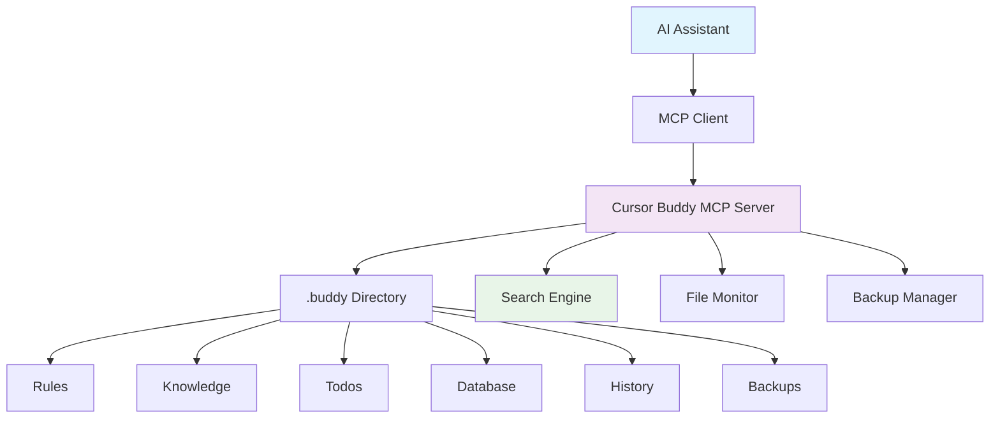

<div align="center">


# Cursor Buddy MCP

**🤖 Keep AI Agents Context-Aware & Consistent**

[](https://github.com/omar-haris/cursor-buddy-mcp/pkgs/container/cursor-buddy-mcp)
[](https://golang.org/)
[](https://modelcontextprotocol.io)
[](LICENSE)

*Transform your AI assistant into a context-aware coding partner that understands your project's standards, conventions, and history.*

[🚀 Quick Start](#-quick-start) • [📚 Documentation](#-documentation) • [🔧 Tools](#-available-tools) • [💡 Examples](#-usage-examples)

</div>

---

## 🎯 Why Cursor Buddy MCP?

<table>
<tr>
<td width="50%">

### 🧠 **Context-Aware AI**
Your AI assistant instantly knows your coding standards, architectural patterns, and project conventions

### 📚 **Centralized Knowledge**
All project documentation and guidelines in one searchable location

### ✅ **Progress Tracking**
Automatic todo management and implementation history tracking

</td>
<td width="50%">

### 🔄 **Real-time Updates**
File monitoring ensures your AI always has the latest information

### 🚀 **Zero Setup Friction**
Drop-in Docker container with immediate MCP integration

### 🔍 **Intelligent Search**
Fast, relevant results across all your project context

</td>
</tr>
</table>

---

## 📋 Table of Contents

- [🎯 Why Cursor Buddy MCP?](#-why-cursor-buddy-mcp)
- [🏗️ Architecture](#️-architecture)
- [🚀 Quick Start](#-quick-start)
- [🔧 Available Tools](#-available-tools)
- [💡 Usage Examples](#-usage-examples)
- [📚 Documentation](#-documentation)
  - [📋 Rules Files](#-rules-files)
  - [📖 Knowledge Files](#-knowledge-files)
  - [✅ Todo Files](#-todo-files)
  - [🗄️ Database Files](#️-database-files)
- [💎 Best Practices](#-best-practices)
- [🔧 Advanced Features](#-advanced-features)
- [🤝 Contributing](#-contributing)

---

## 🏗️ Architecture

<div align="center">



</div>

Built on the [Model Context Protocol (MCP)](https://modelcontextprotocol.io) using the Go SDK from [mark3labs/mcp-go](https://github.com/mark3labs/mcp-go). Communicates over stdin/stdout using JSON-RPC 2.0, making it compatible with MCP clients like Claude Desktop.

### 🎨 Features

| Feature | Description |
|---------|-------------|
| **🔧 Tools** | 6 interactive tools for managing project context |
| **📊 Resources** | Project context resource with complete project state |
| **🔄 Stdio Transport** | Standard input/output communication |
| **⚡ Real-time Updates** | File monitoring with automatic reloading |
| **🔍 Full-text Search** | Bleve-powered search across all content |
| **💾 Automatic Backups** | Safe file modifications with rollback capability |

---

## 🚀 Quick Start

### 1️⃣ Pull from GitHub Registry

```bash
docker pull ghcr.io/omar-haris/cursor-buddy-mcp:latest
```

### 2️⃣ Configure Cursor

Add to `.cursor/mcp.json`:

> **⚠️ Important**: Replace `/path/to/your/project/` with your actual project directory path!

```json
{
  "mcpServers": {
    "cursor-buddy-mcp": {
      "command": "docker",
      "args": [
        "run", "-i", "--rm",
        "-v", "/path/to/your/project/.buddy:/home/buddy/.buddy",
        "-e", "BUDDY_PATH=/home/buddy/.buddy",
        "ghcr.io/omar-haris/cursor-buddy-mcp:latest"
      ]
    }
  }
}
```

**Examples:**
- Linux/macOS: `"/home/user/myproject/.buddy:/home/buddy/.buddy"`
- Windows: `"C:/Users/User/myproject/.buddy:/home/buddy/.buddy"`
- Current directory: `"${PWD}/.buddy:/home/buddy/.buddy"`

**💡 How to find your project path:**
```bash
# Navigate to your project directory and run:
pwd
# Copy the output and replace /path/to/your/project/ with: {output}/.buddy
```

### 3️⃣ Create .buddy Structure

Navigate to your project directory and run:

```bash
mkdir -p .buddy/{rules,knowledge,todos,database,history,backups}
```

**📁 This will create:**
```
your-project/
├── .buddy/
│   ├── rules/
│   ├── knowledge/
│   ├── todos/
│   ├── database/
│   ├── history/
│   └── backups/
```

### 4️⃣ Add Your Content

Create files in `.buddy/` folders following the [documentation](#-documentation) below.

---

## 🔧 Available Tools

<table>
<tr>
<td width="50%">

### 📋 **buddy_get_rules**
Get coding standards and guidelines
- Filter by category or priority
- Support for multiple rule types

### 🔍 **buddy_search_knowledge**
Search project documentation
- Full-text search across all knowledge
- Category and tag filtering

### ✅ **buddy_manage_todos**
List/update tasks and track progress
- Feature-based organization
- Progress tracking and completion

</td>
<td width="50%">

### 🗄️ **buddy_get_database_info**
Get schema info and validate queries
- Table schema information
- Query validation and examples

### 📚 **buddy_history**
Track implementation changes and search history
- Implementation timeline
- Feature development tracking

### 💾 **buddy_backup**
Create and manage file backups
- Automatic backup creation
- Safe file modifications

</td>
</tr>
</table>

---

## 💡 Usage Examples

Ask your AI assistant questions like:

<div align="center">

| 🎯 **Category** | 💬 **Example Questions** |
|----------------|-------------------------|
| **📋 Coding Standards** | *"What are our coding standards for error handling?"* |
| **✅ Project Progress** | *"Show me current todos for the authentication feature"* |
| **📖 Documentation** | *"Search for API documentation about user endpoints"* |
| **🗄️ Database** | *"What's the database schema for the users table?"* |
| **📚 History** | *"How did we implement JWT authentication last month?"* |
| **🔧 Architecture** | *"What design patterns should I use for this feature?"* |

</div>

---

## 📚 Documentation

### 📋 Rules Files

> **Location:** `.buddy/rules/`  
> **Purpose:** Define coding standards, architectural patterns, and guidelines

#### 📝 Format Requirements
- ✅ Use markdown format (`.md`)
- ✅ Include metadata: `category` and `priority`
- ✅ Organize with clear sections and subsections

#### 🔧 Example: Coding Standards

<details>
<summary>Click to expand coding standards example</summary>

```markdown
# Coding Standards
- category: coding
- priority: critical

## Overview
Core coding standards and best practices for the project.

## Go-Specific Standards
- Follow Go naming conventions (camelCase, PascalCase)
- Use `gofmt` for code formatting
- Handle errors explicitly, don't ignore them
- Use interfaces for abstraction

## Error Handling
- Always check and handle errors
- Use structured error types
- Wrap errors with context using `fmt.Errorf`
- Return meaningful error messages

## Testing
- Write unit tests for all public functions
- Use table-driven tests for multiple test cases
- Achieve minimum 80% code coverage
```

</details>

#### 🏗️ Example: Architecture Patterns

<details>
<summary>Click to expand architecture patterns example</summary>

```markdown
# Architecture Patterns
- category: architecture
- priority: critical

## Design Principles
- **Single Responsibility**: Each component has one reason to change
- **Dependency Inversion**: Depend on abstractions, not concretions

## Recommended Patterns

### Repository Pattern
- Encapsulate data access logic
- Provide consistent interface for data operations
- Enable easy testing with mock implementations

### Layered Architecture
┌─────────────────────┐
│   Presentation      │  ← HTTP handlers, CLI
├─────────────────────┤
│   Business Logic    │  ← Domain models, use cases
├─────────────────────┤
│   Data Access       │  ← Repositories, databases
└─────────────────────┘
```

</details>

---

### 📖 Knowledge Files

> **Location:** `.buddy/knowledge/`  
> **Purpose:** Store project documentation, API specs, and technical information

#### 📝 Format Requirements
- ✅ Use markdown format (`.md`)
- ✅ Include metadata: `category` and optional `tags`
- ✅ Structure with clear headings and examples

#### 🌐 Example: API Documentation

<details>
<summary>Click to expand API documentation example</summary>

```markdown
# API Documentation
- category: architecture
- tags: api, rest, authentication

## Authentication Endpoints

### POST /auth/login
**Request:**
```json
{
  "email": "user@example.com",
  "password": "secure_password"
}
```

**Response:**
```json
{
  "token": "jwt_token_here",
  "user": {
    "id": 123,
    "email": "user@example.com",
    "role": "user"
  }
}
```

### GET /auth/me
**Headers:** `Authorization: Bearer <token>`

**Response:**
```json
{
  "user": {
    "id": 123,
    "email": "user@example.com",
    "role": "user"
  }
}
```

## Error Handling
All endpoints return errors in this format:
```json
{
  "error": "error_code",
  "message": "Human readable message"
}
```
```

</details>

---

### ✅ Todo Files

> **Location:** `.buddy/todos/`  
> **Purpose:** Track tasks, features, and project progress

#### 📝 Format Requirements
- ✅ Use markdown format (`.md`)
- ✅ Use checkbox syntax: `- [ ]` (incomplete) or `- [x]` (complete)
- ✅ Group related tasks under clear headings
- ✅ Include context and details for each task

#### 🔐 Example: Feature Development

<details>
<summary>Click to expand feature development example</summary>

```markdown
# Authentication Feature

## Backend Implementation
- [x] Set up JWT library
- [x] Create user model and database migration
- [x] Implement password hashing with bcrypt
- [ ] Create login endpoint
- [ ] Create registration endpoint
- [ ] Add middleware for protected routes
- [ ] Write unit tests for auth service
- [ ] Add integration tests for auth endpoints

## Frontend Implementation
- [ ] Create login form component
- [ ] Create registration form component
- [ ] Implement JWT token storage
- [ ] Add authentication context
- [ ] Create protected route wrapper
- [ ] Handle token refresh logic

## Security & Testing
- [ ] Add rate limiting to auth endpoints
- [ ] Implement account lockout after failed attempts
- [ ] Add password strength validation
- [ ] Security audit of auth implementation
- [ ] Load testing for auth endpoints
```

</details>

---

### 🗄️ Database Files

> **Location:** `.buddy/database/`  
> **Purpose:** Store SQL schema definitions, migrations, and query examples

#### 📝 Example: Schema Definition

<details>
<summary>Click to expand database schema example</summary>

```sql
-- Users table
CREATE TABLE users (
    id SERIAL PRIMARY KEY,
    email VARCHAR(255) UNIQUE NOT NULL,
    password_hash VARCHAR(255) NOT NULL,
    role VARCHAR(50) DEFAULT 'user',
    created_at TIMESTAMP DEFAULT CURRENT_TIMESTAMP,
    updated_at TIMESTAMP DEFAULT CURRENT_TIMESTAMP
);

-- Sessions table for JWT blacklisting
CREATE TABLE sessions (
    id SERIAL PRIMARY KEY,
    user_id INTEGER REFERENCES users(id) ON DELETE CASCADE,
    token_hash VARCHAR(255) UNIQUE NOT NULL,
    expires_at TIMESTAMP NOT NULL,
    created_at TIMESTAMP DEFAULT CURRENT_TIMESTAMP
);

-- Indexes for performance
CREATE INDEX idx_users_email ON users(email);
CREATE INDEX idx_sessions_token_hash ON sessions(token_hash);
CREATE INDEX idx_sessions_expires_at ON sessions(expires_at);
```

</details>

---

## 💎 Best Practices

<div align="center">

| 🎯 **Practice** | 📝 **Description** |
|----------------|-------------------|
| **🔍 Be Specific** | Include concrete examples and code snippets |
| **🔄 Stay Updated** | Regularly review and update your files |
| **📐 Consistent Formatting** | Follow the same structure across similar files |
| **💡 Include Context** | Add explanations for why rules or patterns exist |
| **🔗 Link Information** | Reference related files or external documentation |
| **📊 Version Control** | Keep your `.buddy` folder in version control |
| **🔄 Regular Reviews** | Schedule periodic reviews of your knowledge base |

</div>

---

## 🔧 Advanced Features

### 🔍 **File Monitoring**
The server automatically monitors your `.buddy` directory for changes and reloads content in real-time.

### 🔎 **Search Integration**
Uses Bleve full-text search for fast, relevant results across all your project context.

### 💾 **Backup Management**
Automatically creates backups of important files before modifications.

### 🏗️ **Extensible Architecture**
Built with Go for high performance and easy extension with new tools and features.

---

## 🤝 Contributing

We welcome contributions! Here's how you can help:

1. **🐛 Report Issues**: Found a bug? [Open an issue](https://github.com/omar-haris/cursor-buddy-mcp/issues)
2. **💡 Suggest Features**: Have an idea? [Start a discussion](https://github.com/omar-haris/cursor-buddy-mcp/discussions)
3. **🔧 Submit PRs**: Ready to code? Fork, develop, and submit a pull request
4. **📚 Improve Docs**: Help us make the documentation better

---

<div align="center">

## 🎉 Ready to Get Started?

Your AI assistant will now have deep context about your codebase and can provide consistent, informed responses.

**[⬆️ Back to Top](#cursor-buddy-mcp)**

---

*Made with ❤️ by developers, for developers*

</div> 